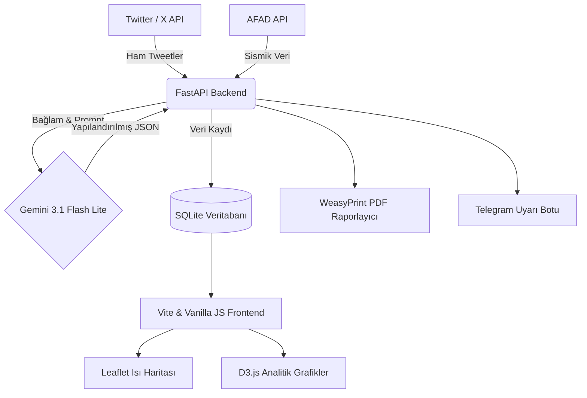

<div align="center">
  <h1>AfetİZ — Kriz İzleme ve Raporlama Paneli</h1>
  <p><b>HackNiğde 2026 Hackathon Projesi</b></p>

  [](https://fastapi.tiangolo.com/)
  [](https://deepmind.google/technologies/gemini/)
  [](https://vitejs.dev/)
  [](https://opensource.org/licenses/MIT)

  <br />
  <p align="center">
    Afet durumlarında sosyal medya verilerini (Twitter/X) ve AFAD verilerini <b>Gemini AI</b> ile eşzamanlı olarak analiz edip, kriz noktalarını tespit eden ve gelişmiş PDF raporları üreten profesyonel bir kriz yönetim platformu.
  </p>
</div>

---

## 🌟 Öne Çıkan Özellikler

- **🤖 Akıllı Analiz (Gemini AI)**: Sosyal medya gönderilerini gelişmiş "Few-Shot Prompting" teknikleri ile yapılandırılmış JSON verisine (`il`, `ilçe`, `ihtiyaç_türü`, `aciliyet_skoru`) çevirir.
- **🗺️ Gerçek Zamanlı Kriz Haritası**: Leaflet ve D3.js entegrasyonuyla ısı haritaları oluşturur ve kritik ihtiyaç noktalarını kırmızı renkle vurgular.
- **📊 Gelişmiş PDF Raporlama**: WeasyPrint ve Pandas/Matplotlib desteği ile yöneticiler için detaylı, grafik destekli analiz ve durum raporları (`afet_raporu.pdf`) oluşturur.
- **📱 Telegram Bot Entegrasyonu**: Kriz durumlarında yetkililere veya ilgili gruplara anlık uyarılar iletir.
- **🌍 AFAD Veri Entegrasyonu**: `son-depremler-afad-api` kullanılarak resmi AFAD sismik verilerini sisteme dahil eder.
- **🛡️ Rate-Limit Koruması**: Gemini 3.1 Flash Lite API'sinin kota sınırlarına (15 RPM / 500 RPD) uygun olarak optimize edilmiş çalışma yapısı.
- **🔄 Otonom Veri Çekimi (Polling)**: Twitter/X API'sinden (Tweepy) veya Mock sistemlerden periyodik olarak veri toplar ve işler.

## 🏗️ Sistem Mimarisi



## 🚀 Kurulum & Çalıştırma

### 📌 Gereksinimler
- **Python:** 3.11 veya üzeri (Conda önerilir)
- **Node.js:** 18 veya üzeri
- **API Anahtarları:** 
  - [Google AI Studio](https://aistudio.google.com)'dan alınmış Gemini API Key
  - Twitter Bearer Token (İsteğe bağlı, canlı veri için)
  - Telegram Bot Token (İsteğe bağlı, bildirimler için)

### ⚙️ Backend Kurulumu

```bash
# Sanal ortam oluşturma ve aktifleştirme
conda create -n hacknigde python=3.11 -y
conda activate hacknigde

# Backend dizinine geçiş
cd backend

# Çevresel değişkenleri ayarlama
cp .env.example .env
# .env dosyasını düzenleyerek GEMINI_API_KEY, TWITTER_KEY vb. değişkenleri girin.

# Bağımlılıkların yüklenmesi
pip install -r requirements.txt

# Sunucuyu başlatma
python main.py
```
> **Backend URL:** `http://localhost:8000`  
> **Swagger API Dökümantasyonu:** `http://localhost:8000/docs`

### 🎨 Frontend Kurulumu

```bash
# Frontend dizinine geçiş
cd frontend

# Paketlerin yüklenmesi
npm install

# Geliştirme sunucusunu başlatma
npm run dev
```
> **Frontend URL:** `http://localhost:3000` (veya terminalde belirtilen port)

## 📡 Temel API Endpoint'leri

| HTTP Metodu | Endpoint | Açıklama |
| :--- | :--- | :--- |
| `GET` | `/health` | Sistem sağlık kontrolü ve durumu |
| `GET` | `/tweets` | Veritabanındaki / önbellekteki güncel tweetler |
| `POST` | `/analyze` | Tekil bir metni Gemini ile analiz etme |
| `POST` | `/analyze-all` | Bekleyen tüm ham veriyi toplu olarak analiz etme |
| `GET` | `/results` | Tamamlanmış analiz sonuçlarını getirme |
| `POST` | `/mock-tweet` | Sisteme test / demo verisi enjekte etme |
| `POST` | `/generate-report` | Güncel verilerle PDF rapor oluşturma (`afet_raporu.pdf`) |

## 💡 Gemini Analiz Örneği (Örnek Çıktı)

Sistemin ham metni nasıl yapılandırdığına dair örnek JSON çıktısı:

```json
{
  "city": "Hatay",
  "district": "Antakya",
  "neighborhood": "Cumhuriyet Mahallesi",
  "need_types": ["arama_kurtarma", "saglik", "gida"],
  "urgency_score": 5,
  "confidence": 0.98,
  "summary": "Enkaz altında yaralılar bulunuyor, acil arama kurtarma ve medikal destek talebi var.",
  "map_priority": "critical"
}
```

## 🛠️ Teknoloji Yığını (Tech Stack)

### 🔙 Backend & Yapay Zeka
- **FastAPI & Uvicorn:** Yüksek performanslı asenkron API sunucusu
- **Google Gemini 3.1 Flash Lite:** Gelişmiş LLM tabanlı metin analizi ve sınıflandırma
- **Pandas, Matplotlib, Seaborn:** Veri manipülasyonu, istatistik ve görselleştirme
- **WeasyPrint & Jinja2:** Dinamik PDF rapor üretimi
- **Tweepy & python-telegram-bot:** Dış servis (Twitter ve Telegram) entegrasyonları
- **SQLite:** Hafif ve entegre veritabanı

### 🖼️ Frontend
- **Vite:** Yeni nesil, ultra hızlı frontend yapılandırıcısı
- **Vanilla JS & CSS:** Framework bağımsız, performans odaklı arayüz
- **Leaflet.js & leaflet-heat:** Coğrafi bilgi sistemleri (GIS) ısı haritaları
- **D3.js v7:** Veri odaklı gelişmiş grafikler (Data-Driven Documents)

## 👨‍💻 Geliştirici Ekip

**Takım:** TheTrippleLoop — (HackNiğde 2026)  
- **Mehmet ERSOLAK** (Backend)

## 📄 Lisans

Bu proje [MIT Lisansı](LICENSE) altında lisanslanmıştır. Kullanım ve dağıtım detayları için `LICENSE` dosyasına göz atabilirsiniz.
